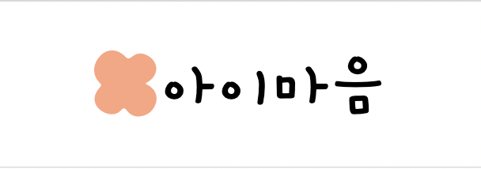

# 🧸 아이마음



## 📌 Intro

아이마음은 <b>AI 챗봇 기반 심리 상담 보조 도구를 이용한 상담 플랫폼</b> 입니다. <br>
속마음을 잘 드러내지 않는 아이들에게 맞춤 인형을 제공하여 친밀감을 형성하고 대화 데이터를 수집합니다. <br>
수집된 데이터를 기반으로 통계 및 분석 데이터를 제공하며, 실시간 상담 및 상담사 연결 서비스를 제공합니다.<br>

## 💻 Developers
<div align="center">
    <table border="1">
        <th><a href="https://github.com/HeoYoon1">허윤</a></th>
        <th><a href="https://github.com/pangthing">박광명</a></th>
        <tr>
            <td>
                
            <td>
                
            </td>
            </td>
        </tr>
    </table>
</div>

## 🔨 Environment

##### Language 


##### Library


<br/>


##### Communication
   

##### Development


## ⚙️ Project Settings

#### Install Library

````console
> pip install requirements.txt
````


## 📚 Documentations


## 🔒 LICENSE

[MIT License](https://lab.hanium.or.kr/22_HF311/k-doll-web-front/-/blob/master/LICENSE)


